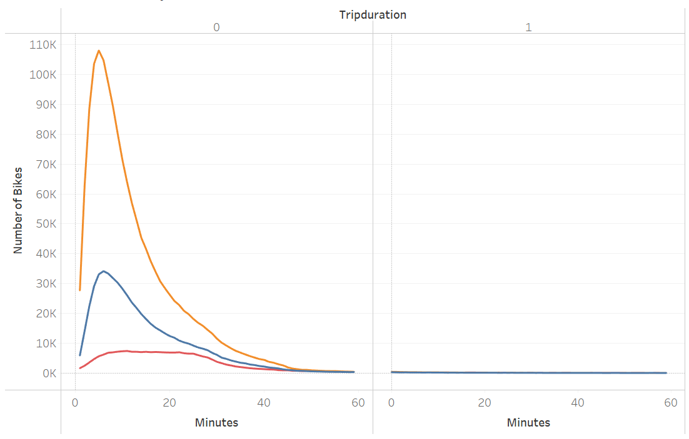

# **Bike-sharing Data Analysis**

## **Bike-sharing Data Analysis Overview:**

One of the key stakeholders for this project would like to see a bike trip analysis to determine if a bike-sharing program in Des Moines is a solid business investment. The following set of visualizations were create to share with the stakeholder:

  - The length of time that bikes are checked out for all riders and genders
  - The number of bike trips for all riders and genders for each hour of each day of the week
  - The number of bike trips for each type of user and gender for each day of the week

## **Bike-sharing Data Analysis Results:**

Please refer to the [Bike-sharing Data Story](https://public.tableau.com/app/profile/rebekah.rutland/viz/Module14Challenge-BikesharingDataStory/BikesharingDataStory) and [Bike-sharing Data Dashboard](https://public.tableau.com/app/profile/rebekah.rutland/viz/Module14Challenge-BikesharingDashboard/BikesharingDataDashboard) for a full details.

  - Customer Type - Out of the 2.3 million riders who used the Citi Bike-sharing service in NYC in August of 2019, 81% were annual subscribers, and only 19% were "customers" or short-term riders.
  
   
   
  
  
  - Breakdown of Customer by Gender - The breakdown of riders by gender shows that the majority of the riders' gender is considered male.
  
   
   
   
   
  - Customer Trip Duration - Approximately 49% of riders rode bikes for 10 minutes or less during this time frame.
  
   
    
    
  - Trip Duration by Gender - The peak trip duration for males was 5 mintues with 108,087 riders.  The peak trip duration for females was 6 minutes with 34,151 riders. 
  
   
    
    
  - Trips by Day of Week per Hour - Peak hours from Monday to Friday appear to be 6 to 9 AM and 4 to 8 PM.  Peak hours on weekends are from 10 to 7.
  
   
   
    
  - Trips by Day of Week per Hour Gender Breakdown - Males made the majority of the trips with 1,530,272 trips, and females made 588,431 trips.
  
   
  
  
  - Trips by User Type and Gender by Day of Week - The most popular day for bike riding for male suscribers was Thursday.
  
  
  
  

## **Bike-sharing Data Analysis Summary:**

There is a high-level summary of the results and two additional visualizations are suggested for future analysis (5 pt)
Summary: Provide a high-level summary of the results and two additional visualizations that you would perform with the given dataset.
