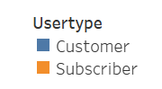

# **Bike-sharing Data Analysis**

## **Bike-sharing Data Analysis Overview:**

One of the key stakeholders for this project would like to see a bike trip analysis to determine if a bike-sharing program in Des Moines is a solid business investment. The following set of visualizations were create to share with the stakeholder:

  - The length of time that bikes are checked out for all riders and genders
  - The number of bike trips for all riders and genders for each hour of each day of the week
  - The number of bike trips for each type of user and gender for each day of the week

## **Bike-sharing Data Analysis Results:**

Results:
Finally, you’ll add these new visualizations to the two you created in this module for your final presentation and analysis to pitch to investors.
There are at least seven visualizations for the NYC Citibike analysis (7 pt)
There is a description of the results for each visualization (7 pt)
Results: Using the visualizations you have in your Tableau Story, describe the results of each visualization underneath the image.

 
 
  
 
 

## **Bike-sharing Data Analysis Summary:**

Please refer to the [Bike-sharing Data Story](https://public.tableau.com/app/profile/rebekah.rutland/viz/Module14Challenge-BikesharingDataStory/BikesharingDataStory) for a full summary of results.

There is a high-level summary of the results and two additional visualizations are suggested for future analysis (5 pt)
Summary: Provide a high-level summary of the results and two additional visualizations that you would perform with the given dataset.
